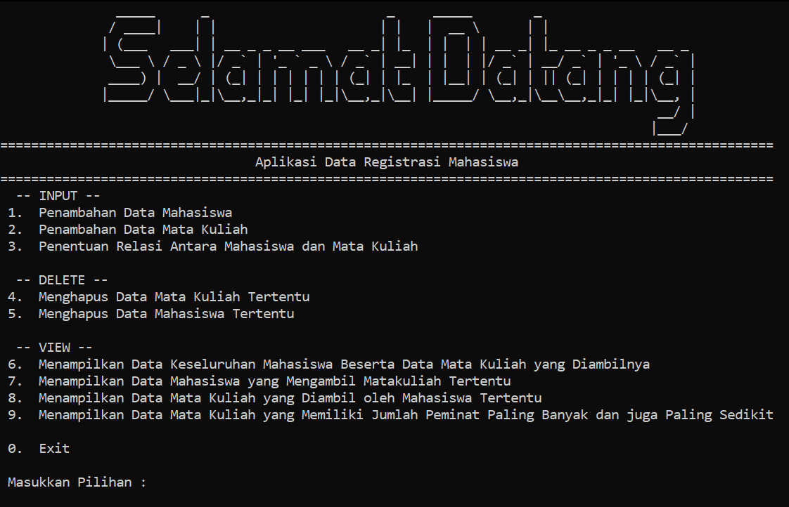

<h1 align="center">
   
</h1>

Final Task for Data Structure Course at Telkom University.
CLI based. 
Implemented in C++.

## Structures
### Mahasiswa
Using Circular Single Linked-List.
Act as the parent of relational list.

### Relasi
Using Single Linked-List.
Act as multi-double linked list alias relational list.

### Mata Kuliah
Using Double Linked-List.
Act as the child of relational list.

## To Do List

Mahasiswa :

* [x] Defining and Implement alocation
* [x] Defining and Implement input operation
* [x] Defining and Implement delete operation
* [x] Defining and Implement view operation
* [x] Defining and Implement relation data structure

Mata Kuliah :

* [x] Defining and Implement alocation
* [x] Defining and Implement input operation
* [x] Defining and Implement delete operation
* [x] Defining and Implement view operation
* [x] Defining and Implement relation data structure

Task :

* [x] Add new Mahasiswa
* [x] Add new Mata Kuliah
* [x] Add relation between Mahasiswa and Mata Kuliah
* [x] Remove certain Mahasiswa
* [x] Remove certain Mata Kuliah
* [x] Show all Mahasiswa with all of Mata Kuliah they took
* [x] Show Mahasiswa that took certain Mata Kuliah
* [x] Show Mata Kuliah that has been taken by certain Mahasiswa
* [x] Show Mata Kuliah that has the most and the least number of Mahasiswa
